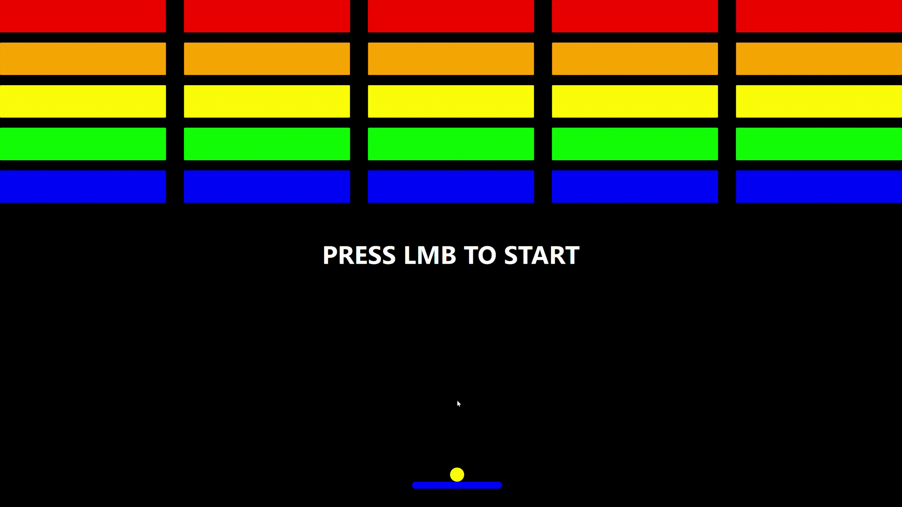

# Breakout
C++ implementation of the classic Breakout game using Qt 6.9.2.

Frontend is rendered using QML engine.

**Windows executable is provided.**

# Tests
Unit tested using Google Test 1.17.0

# How to run on Windows
1. Download release zip from:\
https://github.com/adam-choragwicki/Breakout_Game_Qt_Cplusplus_QML/releases/latest/download/executable_windows.zip
2. Unzip
3. Run **executable_windows/Breakout.exe**
